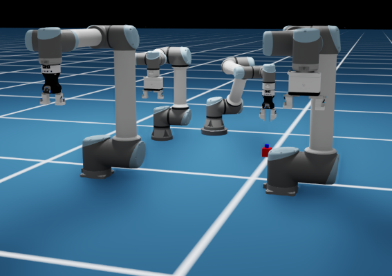

# SDU Utils Extension [omni.sdu.utils]
ISAAC extension developed by SDU that provides various utility functions used by other extensions.

## Dependencies
The python dependencies are:
* [numpy](https://pypi.org/project/numpy/)
* [scipy](https://pypi.org/project/scipy/)

## Getting started 
Start by installing the python dependencies into the NVIDIA python environment with:

    cd ~/.local/share/ov/pkg/isaac_sim-2022.2.1/
    /python.sh -m pip install numpy scipy 

Next, simply clone this repository to ~/Documents/Kit/shared/exts or preferred folder with extensions:

    cd ~/Documents/Kit/shared/exts
    git clone git@gitlab.sdu.dk:sdurobotics/novo/omni.sdu.utils.git

and finally remember to enable the extension in the omniverse extension manager.